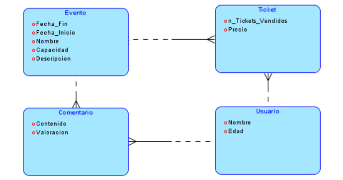

# Proyecto: ALASDOCE

## Integrantes del Equipo

| Nombre | Apellidos | Correo Oficial | GitHub |
|--------|----------|---------------|--------|
| Jon | Mazcuñán Hernández | j.mazcunan.2022@alumnos.urjc.com | [GitHub1](https://github.com/jonmazh) |
| Marcos | Álvarez Mansilla | m.alvarez.2022@alumnos.urjc.es | [GitHub2](**) |
| Robert Gabriel | Mihai | rg.mihai.2022@alumnos.urjc.es | [GitHub3](*https://github.com/robert07112004*) |
| Álvaro | Osuna Flores | a.osuna.2022@alumnos.urjc.es | [GitHub4](**) |

## Descripción del Proyecto

El proyecto consiste en una aplicación web basada en HTML, CSS y BDD que se empleará para la gestión de eventos,
mostrando eventos disponibles en distintos espacios y la compra de entradas para estos, permitiendo dejar comentarios 
en los eventos que se hayan realizado una compra. 

## Herramientas de Desarrollo

- **Lenguaje principal:** HTML, CSS, Java con Spring Boot
- **Base de datos:** MySQL
- **Control de versiones:** GitHub ([Repositorio](https://github.com/tu-repo))
- **Entorno de desarrollo:** Visual Studio Code / Eclipse
- **Gestión del equipo:** Trello / GitHub Projects ([Tablero](https://trello.com/tu-tablero))

## Entidades y Relaciones

La aplicación maneja las siguientes entidades principales:

1. **Usuario** (ID, nombre, email, contraseña, tipo de usuario)
2. **Evento** (Fecha_fin, Fecha_Inicio, Nombre, Capacidad, Descripción)
3. **Ticket** (n_tickets_vendidos, Precio)
4. **Comentario** (Contenido, Valoración)

### Relaciones entre entidades

- `Usuario` puede tener varios `Comentario`
- `Usuario` puede tener varios `Ticket`
- `Evento` puede tener varios `Comentario`
- `Evento` puede tener varios `Ticket`

## Tipos de Usuarios y Permisos

| Tipo de Usuario | Permisos |
|----------------|----------|
| **Anónimo** | Puede visualizar contenido público |
| **Registrado** | Puede crear/modificar contenido propio |
| **Administrador** | Control total sobre la web |

## Gestión de Imágenes

Las siguientes entidades podrán subir imágenes:

- **Usuarios** → Avatar
- **Entidad 1** → Imagen destacada
- **Entidad 3** → Galería de imágenes

## Instrucciones de Ejecución

1. **Clonar el repositorio:**
   ```sh

   ```
2. **Configurar la base de datos:**
  
3. **Compilar y ejecutar la aplicación:**
   ```sh
  
   ```
4. **Acceder a la aplicación:**
 
## Diagrama de Entidades



## Capturas de Pantalla


## Participación de los Miembros

Cada miembro del equipo debe indicar su contribución en la práctica.

### Jon

### Robert

### Álvaro

### Marcos


[](https://classroom.github.com/a/D1C1HU9V)
